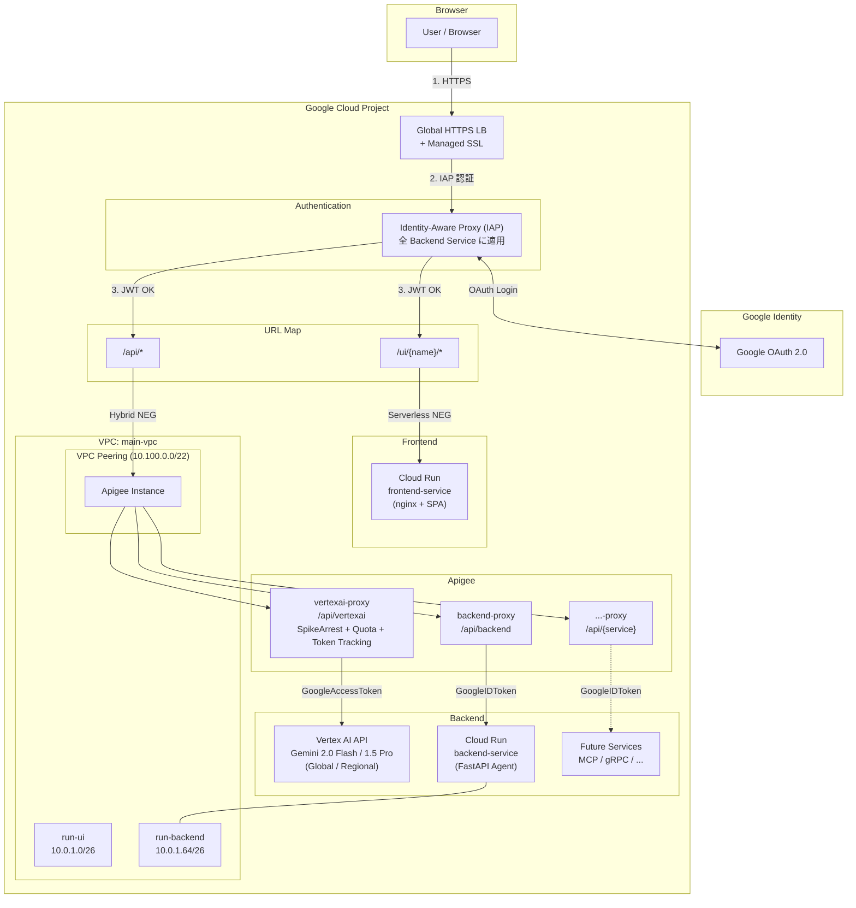
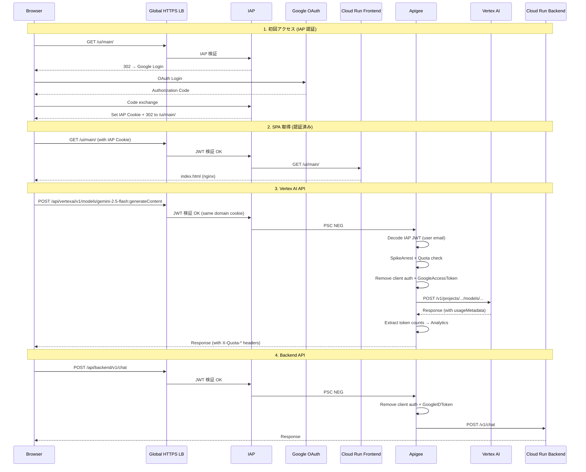
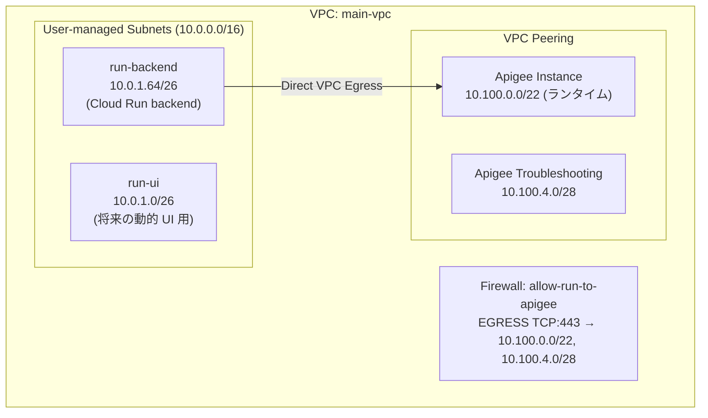
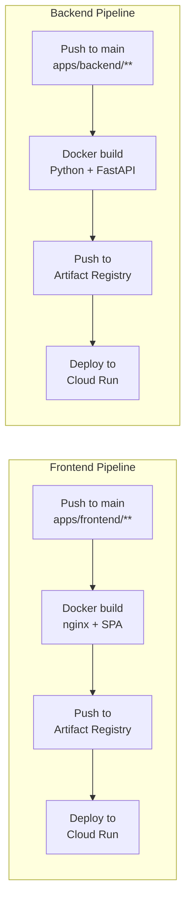

# Apigee Labs

Google Cloud上に Apigee を中心とした API プラットフォームを構築するプロジェクト。
IAP 認証・Vertex AI 統合を含む、本番レベルのアーキテクチャを Terraform で管理。

## Architecture

```
                       ┌──────────────────────────────────────────────────────────┐
                       │                  Google Cloud Project                    │
                       │                                                          │
┌──────────┐  HTTPS    │  ┌──────────────┐                                        │
│          │ ────────► │  │ Global HTTPS │                                        │
│ Browser  │           │  │ LB + SSL     │                                        │
│          │ ◄──────── │  └──────┬───────┘                                        │
└──────────┘           │         │ URL Map                                        │
                       │    ┌────┴────┐                                           │
                       │    ▼         ▼                                           │
                       │ /ui/*     /api/*                                         │
                       │    │         │                                           │
                       │    ▼         ▼                                           │
                       │ ┌─────────────────┐  ┌─────────────────────────────┐     │
                       │ │ Backend Service │  │ Backend Service             │     │
                       │ │ (IAP enabled)   │  │ (IAP enabled)               │     │
                       │ │                 │  │                             │     │
                       │ │  ┌───────────┐  │  │  ┌───────────────────────┐  │     │
                       │ │  │Cloud Run  │  │  │  │ Apigee (PSC NEG)      │  │     │
                       │ │  │frontend   │  │  │  │                       │  │     │
                       │ │  │-service   │  │  │  │ vertexai-proxy        │  │     │
                       │ │  │(nginx)    │  │  │  │  JWT→email,SpikeArrest│  │     │
                       │ │  │           │  │  │  │  Quota,Token Tracking │──┼──► Vertex AI
                       │ │  │           │  │  │  │ backend-proxy (OIDC)  │──┼──► Cloud Run
                       │ │  │           │  │  │  │ {service}-proxy       │──┼──► Future
                       │ │  └───────────┘  │  │  └───────────────────────┘  │     │
                       │ └─────────────────┘  └─────────────────────────────┘     │
                       └──────────────────────────────────────────────────────────┘

  IAP は各 Backend Service に適用:
    ✅ Backend Service (Cloud Run frontend) — /ui/*
    ✅ Backend Service (Apigee PSC NEG)    — /api/*
    → 同一ドメインの IAP Cookie で全パスを保護
```

### Architecture (Mermaid)



### Request Flow



### Network



> **Note**: Apigee インスタンスには /22（ランタイム）と /28（トラブルシューティング）の 2 つの CIDR レンジが必要です。
> 両方をサービスネットワーキングの予約レンジに含め、VPC ピアリングで接続します。
> 詳細: [Apigee ネットワーキング オプション](https://docs.cloud.google.com/apigee/docs/api-platform/get-started/networking-options)

### CI/CD Pipeline



## Project Structure

```
apigee-labs/
├── .terraform-version                    # tfenv: Terraform 1.15.8
├── .github/workflows/
│   ├── frontend-deploy.yml               # Docker → Artifact Registry → Cloud Run
│   └── backend-deploy.yml                # Docker → Artifact Registry → Cloud Run
│
├── apps/
│   ├── frontend/                         # React + Vite + TypeScript (Chat SPA)
│   │   ├── Dockerfile                    # Multi-stage: node build → nginx serve
│   │   ├── nginx.conf                    # SPA routing + security headers
│   │   ├── src/
│   │   │   ├── App.tsx                   # Chat UI + API バックエンド切替
│   │   │   ├── api.ts                    # Vertex AI / Backend Agent API
│   │   │   └── components/               # ChatMessage, ChatInput, BackendSelector
│   │   ├── vite.config.ts                # base: /ui/main/
│   │   └── package.json
│   │
│   └── backend/                          # Python FastAPI (Sample Agent)
│       ├── Dockerfile                    # Multi-stage build
│       └── main.py                       # /v1/health, /v1/chat
│
└── terraform/
    ├── envs/prod/                        # 本番環境
    │   ├── main.tf                       # 全モジュールのオーケストレーション
    │   ├── variables.tf
    │   └── outputs.tf
    │
    └── modules/
        ├── apigee/                       # Apigee Org/Instance/Env/Envgroup
        ├── apigee-vertexai-proxy/        # Vertex AI 専用プロキシ (/api/vertexai)
        ├── apigee-service-proxy/         # 汎用 Cloud Run プロキシ (/api/{service})
        ├── lb/                           # Global HTTPS LB + IAP + パスルーティング
        ├── github-wif/                    # GitHub Actions Workload Identity Federation
        └── iap/                          # IAP OAuth 設定 (gcloud CLI で作成した値を受け渡し)
```

## URL Design

| Path | Destination | IAP | Description |
|------|-------------|-----|-------------|
| `/` | → 302 `/ui/main/` | - | デフォルトリダイレクト |
| `/ui/main/*` | Cloud Run frontend | ✅ | メイン SPA (Chat) |
| `/ui/{name}/*` | Cloud Run | ✅ | 将来の追加フロントエンド |
| `/api/vertexai/v1/models/{model}:{action}` | Apigee → Vertex AI | ✅ | Gemini API (Global) |
| `/api/vertexai/v1/locations/{region}/models/{model}:{action}` | Apigee → Vertex AI | ✅ | Gemini API (Regional) |
| `/api/backend/v1/*` | Apigee → Cloud Run | ✅ | Backend Agent |
| `/api/{service}/v1/*` | Apigee → Cloud Run | ✅ | 将来のサービス追加 |

## Terraform Modules

### `apigee-service-proxy` (汎用)

`service_name` を指定するだけで Apigee プロキシを自動生成。

```hcl
module "backend_proxy" {
  source       = "../../modules/apigee-service-proxy"
  service_name = "backend"    # → BasePath: /api/backend, SA: apigee-backend-proxy-sa
  target_url   = module.backend.service_uri
  ...
}

# 将来: MCP サーバー
module "mcp_proxy" {
  source       = "../../modules/apigee-service-proxy"
  service_name = "mcp"        # → BasePath: /api/mcp
  target_url   = module.mcp_server.service_uri
  ...
}
```

### `lb` (複数フロントエンド + IAP 一括適用)

```hcl
ui_frontends = [
  { name = "main",  cloud_run_service_name = "frontend-service" },
  { name = "admin", cloud_run_service_name = "admin-service" },
]

# iap_config を指定すると全 Backend Service (UI + Apigee) に IAP 適用
iap_config = {
  oauth2_client_id     = var.iap_oauth_client_id
  oauth2_client_secret = var.iap_oauth_client_secret
}
iap_allowed_members = ["user:admin@example.com"]
```

## CI/CD

### Frontend / Backend 共通フロー

```
Push to main → Docker build → Artifact Registry push → Cloud Run deploy
```

- Frontend イメージ: `{region}-docker.pkg.dev/{project}/docker/frontend-service:{sha}`
- Backend イメージ: `{region}-docker.pkg.dev/{project}/docker/backend-service:{sha}`
- Artifact Registry リポジトリ: `docker` (共有)

## Setup

### Prerequisites

- Terraform >= 1.15 (`tfenv` で自動管理)
- Google Cloud プロジェクト (Apigee 有効化済み)
- ドメイン (DNS A レコード設定用)

### GitHub Actions Secrets (Environment: production)

| Secret | Description | 取得方法 |
|--------|-------------|----------|
| `GCP_PROJECT_ID` | Google Cloud プロジェクト ID | 手動設定 |
| `GCP_REGION` | リージョン | 手動設定 |
| `WORKLOAD_IDENTITY_PROVIDER` | WIF プロバイダー | `terraform output github_wif_provider` |
| `GCP_SERVICE_ACCOUNT` | CI/CD 用 SA | `terraform output github_wif_service_account` |

### IAP OAuth クライアントの作成

`google_iap_brand` / `google_iap_client` は 2026-03-19 に廃止されたため、
OAuth クライアントは gcloud CLI または Google Cloud Console で作成する。

```bash
# 1. OAuth 同意画面 (Brand) の作成
gcloud iap oauth-brands create \
  --application_title="Apigee Labs" \
  --support_email="YOUR_EMAIL"

# 2. OAuth クライアントの作成
gcloud iap oauth-clients create \
  "projects/YOUR_PROJECT_NUMBER/brands/YOUR_PROJECT_NUMBER" \
  --display_name="IAP OAuth Client"

# 3. 出力された client_id と client_secret を secrets.auto.tfvars に設定
#   iap_oauth_client_id     = "xxxx.apps.googleusercontent.com"
#   iap_oauth_client_secret = "GOCSPX-xxxx"
```

> **Note**: `YOUR_PROJECT_NUMBER` は `gcloud projects describe YOUR_PROJECT --format='value(projectNumber)'` で取得できます。

### 設定ファイルの準備

`terraform.tfvars` と `secrets.auto.tfvars` はコミットされないため、
example ファイルからコピーして作成します。

```bash
cd terraform/envs/prod

# 非機密の設定 (コミット対象)
cp terraform.tfvars.example terraform.tfvars

# 機密情報 (gitignore 対象、Terraform が自動読み込み)
cp secrets.auto.tfvars.example secrets.auto.tfvars
```

`terraform.tfvars` にはプロジェクト ID・ドメイン・`iap_allowed_members` などの
非機密の値を、`secrets.auto.tfvars` には IAP OAuth クライアントの
`iap_oauth_client_id` / `iap_oauth_client_secret` を設定します。

### Deploy

```bash
cd terraform/envs/prod
terraform init
terraform plan
terraform apply
```
